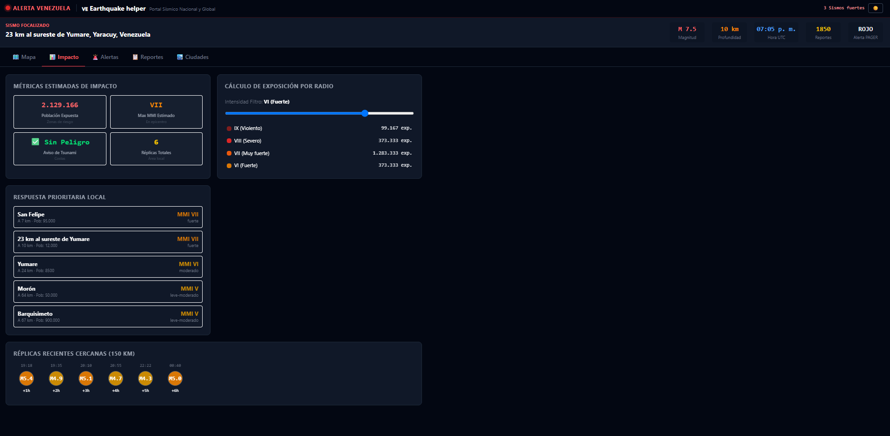
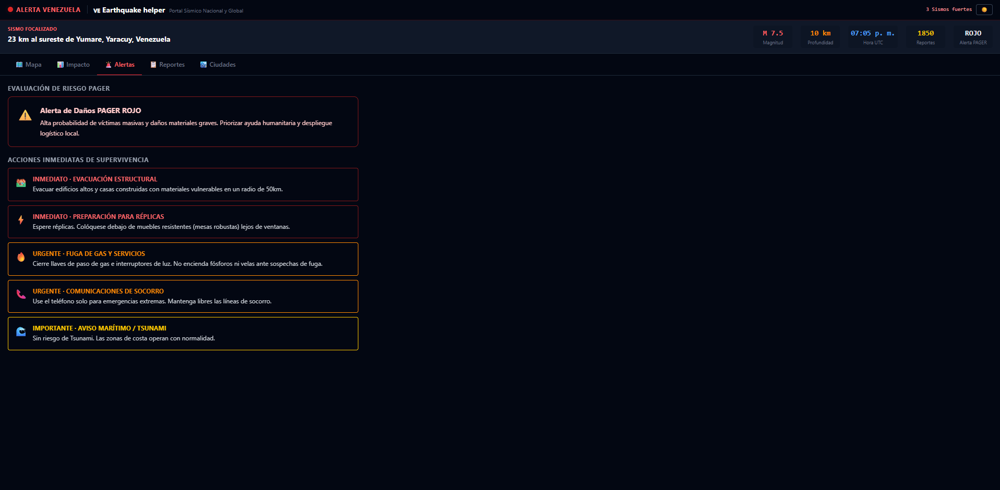
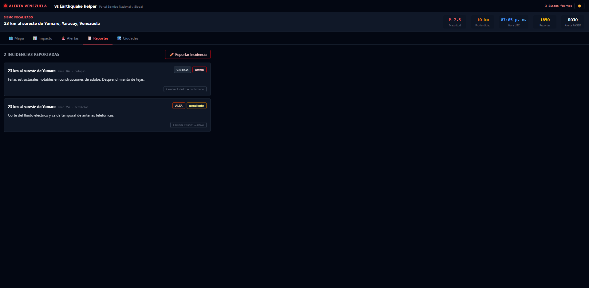
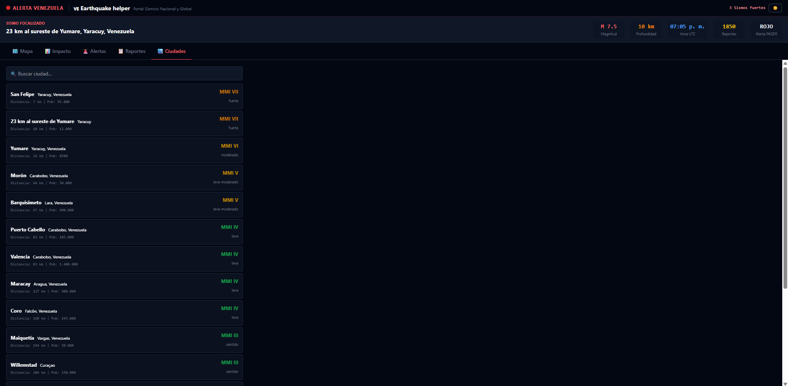

  <h1>🚨 Earthquake Helper</h1>

  
<b>Plataforma premium y solidaria de monitoreo sísmico interactivo y reporte ciudadano en tiempo real.</b>

  

    Un desarrollo de <b>WaveFrame Studio</b> diseñado para informar, orientar y brindar apoyo técnico ante emergencias sísmicas, con especial foco en <b>Venezuela</b> y conexión en tiempo real con los servidores globales de la <b>USGS</b>.
  

  

    
    
    
    
    
  

---

## 🎯 Propósito y Filosofía

Durante situaciones de emergencia sísmica, el acceso inmediato a datos veraces, claros y georreferenciados es determinante para resguardar la seguridad ciudadana. **Earthquake Helper** nace como una iniciativa tecnológica orientada al impacto social y humanitario, unificando la precisión técnica de la *United States Geological Survey (USGS)* con el valioso testimonio en tiempo real emitido por las comunidades afectadas.

---

## 🌟 Características Destacadas

| Función | Descripción |
| :--- | :--- |
| 🌎 **Mapa Interactivo Multicapa** | Visualización táctica sobre *CartoDB Dark Matter*, optimizada para alta legibilidad en situaciones de emergencia. |
| 🇻🇪 **Foco Geográfico Inteligente** | *Bounding box* automatizado para aislar sismos con directo impacto en el Caribe y territorio de Venezuela, con conmutación rápida al feed global. |
| 📊 **Estimador de Impacto Físico (MMI)** | Algoritmos de cálculo basados en la fórmula de *Haversine* e intensidad Mercalli para estimar aceleración, daño en infraestructura y población expuesta. |
| ⚡ **Análisis de Réplicas en Vivo** | Detección automática de eventos sísmicos secundarios en un radio crítico de 150 km del epicentro principal. |
| 📋 **Red de Reporte Ciudadano** | Interfaz ágil para la notificación comunitaria de colapsos estructurales, personas afectadas, cortes eléctricos o de suministro de agua. |
| 📱 **Diseño Ultra-Responsivo** | Navegación optimizada para dispositivos móviles con *drawers* colapsables, *bottom-sheets* e interfaz gestual. |
| 💾 **Resiliencia Offline** | Sistema de respaldo con dataset local precargado que mantiene la operatividad técnica aun sin conectividad a Internet. |

---

## 🖼️ Galería de Imágenes

<table align="center" width="100%">
  <tr>
    <td width="50%" align="center">
      
       
      Vista General del Mapa Sísmico Interactivo
    </td>
    <td width="50%" align="center">
      
       
      Panel de Detalles e Intensidad del Sismo
    </td>
  </tr>
  <tr>
    <td width="50%" align="center">
      
       
      Gestión de Reportes e Incidencias Ciudadanas
    </td>
    <td width="50%" align="center">
      
       
      Filtros de Búsqueda y Métricas de Magnitud
    </td>
  </tr>
  <tr>
    <td colspan="2" align="center">
      
       
      Interfaz Adaptativa para Dispositivos Móviles
    </td>
  </tr>
</table>

---

## 💻 Stack Tecnológico

| Tecnología | Rol en el Ecosistema |
| :--- | :--- |
| **React 19** | Biblioteca principal para la arquitectura reactiva de componentes de interfaz. |
| **Vite 8** | Entorno de desarrollo ultrarrápido y empaquetador optimizado de última generación. |
| **Tailwind CSS v4** | Motor de estilos utilitario de alto rendimiento para diseños modernos y fluidos. |
| **Leaflet & React-Leaflet** | Motor de renderizado cartográfico para la gestión de capas vectoriales y marcadores. |
| **USGS Earthquake API** | API oficial del Servicio Geológico de EE. UU. para suministro de feeds en tiempo real. |

---

## ❤️ Compromiso Humanitario

Este desarrollo es una contribución técnica abierta y sin fines de lucro realizada por el equipo de **WaveFrame Studio**. Reafirmamos nuestro compromiso de usar la tecnología como un puente de resiliencia, prevención y ayuda comunitaria.

 

  <i>Desarrollado con compromiso y rigor técnico por <b>WaveFrame Studio</b>.</i>

